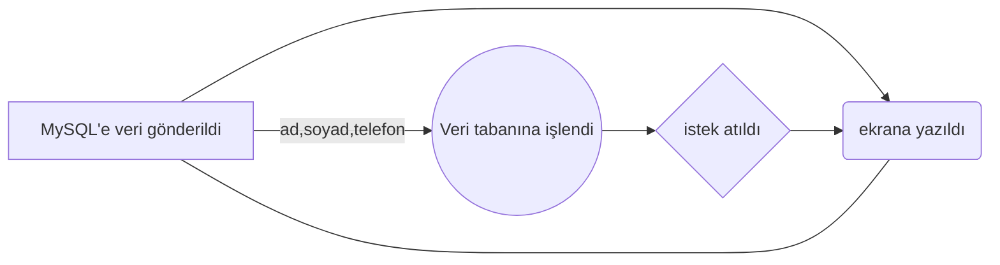

# MySQL-webview-telefon-rehberi

```mermaid
graph LR
A[MySQL'e veri gönderildi] -- ad,soyad,telefon --> B((Veri tabanına işlendi))
A ---> C(ekrana yazıldı)
B --> D{istek atıldı}
D --> C
C <--- A
```
