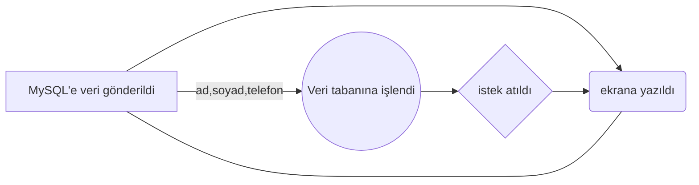

# MySQL-webview-telefon-rehberi

[](https://telefon-rehberi.onrender.com)

[](https://www.digitalocean.com/products/app-platform)

### main.cpp
```c++
#include "libs/webview/webview.h"
#include <gtk/gtk.h>
#include "embedded_files.h"

int main() {
    webview::webview w(true, nullptr);
    w.set_title("Telefon Rehberi");
    w.set_size(800, 600, WEBVIEW_HINT_NONE);
    w.set_html(index_html);
    ...
}
```
  
> ! Note 
> html dosyasını başka bir bilgisiyara aktarıldığı zaman değişikliğe uğramasını istenmediği için embedded_files.h projeye gömülmesi sağlanmıştır.
  
## Arayüz


| Ad | Soyad | Telefon | Sil |
| ------ | ------ | ------ | ------ |
| Kişi-1 | Soyad | (0) 555 555 55 55 |
| Kişi-2 | Soyad | (0) 555 555 55 55 |
| Kişi-3 | Soyad | (0) 555 555 55 55 |
| Kişi-4 | Soyad | (0) 555 555 55 55 |
| Kişi-5 | Soyad | (0) 555 555 55 55 |
| Kişi-6 | Soyad | (0) 555 555 55 55 |



